# 📊 Advanced SQL Case Study

## 📌 Project Objective
Perform in-depth SQL-based analysis on a fictional e-commerce dataset to extract customer trends, sales patterns, supplier insights, and order behavior. Demonstrates proficiency in advanced SQL concepts such as joins, CTEs, subqueries, ranking functions, stored procedures, and view creation.

---

## 📂 Dataset Overview

The analysis is based on 5 relational tables simulating a business transactional system:

- `Customer`: Customer profiles, location, and contact info  
- `Supplier`: Supplier information, location, and company name  
- `Product`: Product metadata including pricing and supplier IDs  
- `Orders`: Header-level details of customer orders  
- `OrderItem`: Line-item level breakdown of each order  

---

📊 **ER Diagram:**  
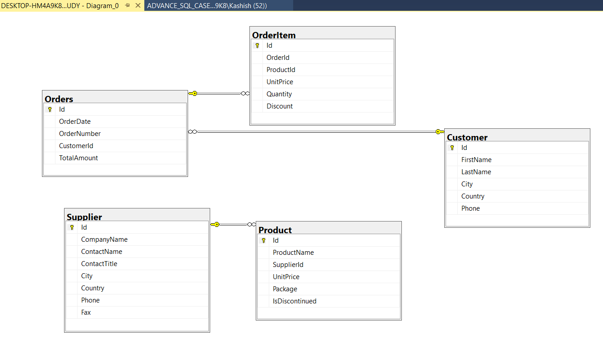  

---

## 🧠 Business Questions Answered

### 🧮 Customer & Geographic Analysis
1. Customer count by country  
2. Top customer regions  
3. Countries with low/high orders  
4. Customers without orders  

### 💸 Revenue & Sales Insights
5. Monthly sales trends  
6. Product pricing filters  
7. Revenue by product & customer  
8. High-value orders  

### 📦 Product & Inventory Trends
9. Most expensive and least-selling products  
10. Products to discontinue  
11. Products above average price  
12. Product sales ranking  

### 🧾 Advanced Analytics & Procedures
13. Top 2 customers per country  
14. Targeted marketing region insights  
15. Orders below 10% quantity threshold  
16. Customers from supplier-less countries  
17. View and stored procedure creation  

---

## ❓ Highlighted Queries with Insights

### 🔍 Q7 – Customers by Country high to low
💻 **Method:** `GROUP BY` + `COUNT()`  
```sql
SELECT Country, COUNT(ID) AS Cust_Count
FROM Customer
GROUP BY Country
ORDER BY Cust_Count DESC;
```
📸 **Screenshot:**  
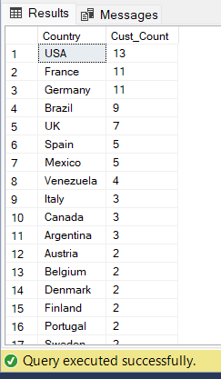

💡 **Insight:**  
Germany, USA, and the France have the highest customer concentrations — key regions for strategic campaigns.

---

### 🌍 Q10 – Countries with ≥9 Customers (Excl. USA)
💻 **Method:** `WHERE`, `GROUP BY`, `HAVING`  
```sql
SELECT Country, COUNT(ID) AS Cust_Count
FROM Customer
WHERE Country <> 'USA'
GROUP BY Country
HAVING COUNT(ID) >= 9
ORDER BY CUST_COUNT DESC;
```
📸 **Screenshot:**  
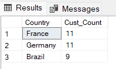

💡 **Insight:**  
Countries like Germany, France and Brazil qualify as regions for focused customer acquisition strategies.

---

### 💰 Q23 – Suppliers Without Fax Numbers
💻 **Method:**Used CASE WHEN to assign a label “No FAX Number” where the fax field is either NULL or blank. Displayed the actual fax number otherwise.`  
```sql
SELECT ID, CompanyName, ContactName, ContactTitle, City, Country, Phone ,
CASE	
	WHEN Fax IS NULL OR Fax = ''	
		THEN 'No FAX Number'
	ELSE Fax
END AS Fax_Number 
FROM Supplier;
```
📸 **Screenshot:**  
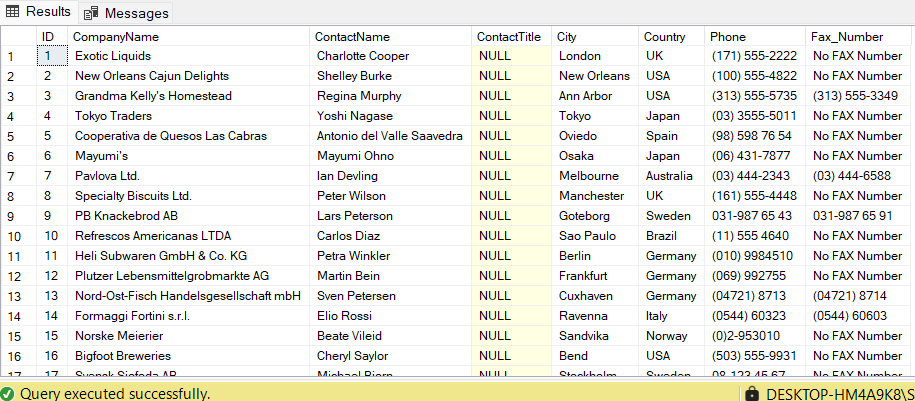

💡 **Insight:**  
Almost one-third of suppliers are missing fax numbers, indicating outdated contact records. Labeling them helps take corrective actions.
---

### 📦 Q24 – Orders With Product Breakdown
💻 **Method:** `JOIN` + `GROUP BY`  
```sql
SELECT O.Id, OrderDate, ProductName, SUM(Quantity) AS Quantity, SUM(TotalAmount) Prices
FROM Orders AS O
INNER JOIN OrderItem AS OI
ON O.Id = OI.OrderId
INNER JOIN Product AS P
ON OI.ProductId = P.Id
GROUP BY O.Id, OrderDate, ProductName;
```
📸 **Screenshot:**  
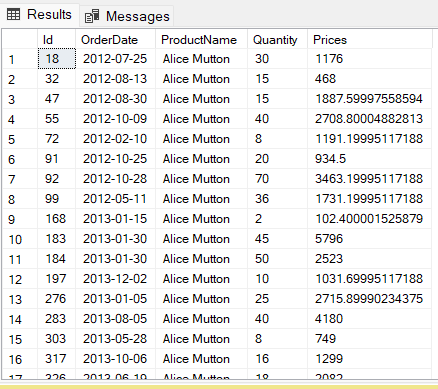

💡 **Insight:**  
Invoice-style summary of orders helps determine product frequency and customer preferences.

---

### 🚫  Q26 – Suppliers & Customers: Country Match Status
💻 **Method:** Used three `JOIN` types (LEFT, RIGHT, INNER) with `UNION`  
```sql
SELECT FirstName, LastName, C.Country AS CustomerCountry, s.Country as Supplier_Country,
CompanyName
FROM Supplier AS S
LEFT JOIN Customer AS C
ON S.Country = C.Country
WHERE C.Country IS NULL
UNION
SELECT FirstName, LastName, C.Country AS CustomerCountry, s.Country as Supplier_Country,
CompanyName
FROM Supplier AS S
RIGHT JOIN Customer AS C
ON S.Country = C.Country
WHERE S.Country IS NULL
UNION
SELECT FirstName, LastName, C.Country AS CustomerCountry, s.Country as Supplier_Country,
CompanyName
FROM Supplier AS S
INNER JOIN Customer AS C
ON S.Country = C.Country;
```
📸 **Screenshot:**  
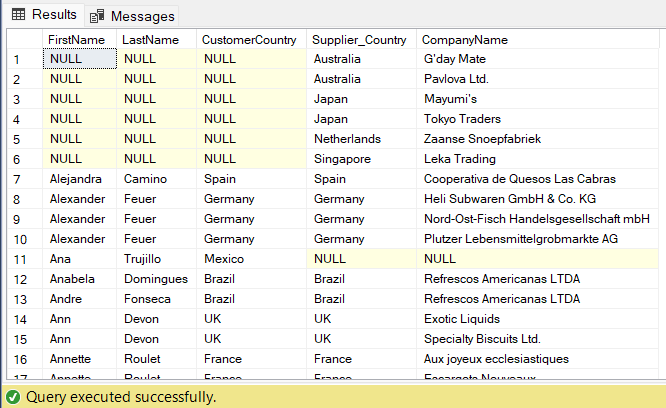

💡 **Insight:**  
This comprehensive match check highlights gaps in supplier-customer presence by country. It aids in identifying underserved markets and optimizing cross-border logistics planning.
---

### ⏱️ Q30 – Last Order from Paris vs Overall
💻 **Method:** Subquery + `DATEDIFF()`  
```sql
SELECT *, DATEDIFF(DAY, [Last Paris Order], [Last Order Date]) AS [Difference in Days]
FROM (
  SELECT TOP 1 O.Id, OrderDate AS [Last Paris Order],
         (SELECT MAX(OrderDate) FROM Orders) AS [Last Order Date]
  FROM Customer AS C
  INNER JOIN Orders AS O ON C.Id = O.CustomerId
  WHERE City = 'Paris'
  ORDER BY OrderDate DESC
) AS X;
```
📸 **Screenshot:**  
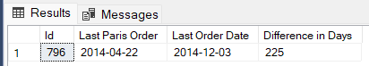

💡 **Insight:**  
Useful to evaluate delivery time differences between local and overall shipments.

---

### 📉 Q32 – Customers in Low-Order Countries
💻 **Method:** CTE + Subquery  
```sql
WITH Top_5_Countries
AS (SELECT TOP 5 Country, COUNT(O.Id) AS Order_Count
		FROM Customer AS C
		INNER JOIN Orders AS O
		ON C.Id = O.CustomerId
		GROUP BY Country
		ORDER BY ORDER_COUNT ASC),
Cust_Info
AS (SELECT* 
     FROM Customer
	 WHERE Country IN (SELECT Country from Top_5_Countries) )
SELECT* FROM Cust_Info
ORDER BY Country;
```
📸 **Screenshot:**  
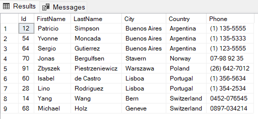

💡 **Insight:**  
Helpful for launching marketing in low-performing geographies.

---

### 🏆 Q35 – Top 2 Customers per Country
💻 **Method:** CTE + `DENSE_RANK()`  
```sql
WITH Customer_Order_Data
AS ( SELECT C.Id, FirstName, LastName, Country, 
    SUM(UnitPrice * Quantity * (1-Discount)) AS Dollar_Amount
    FROM Customer AS C
	INNER JOIN Orders AS O
	ON c.Id = o.CustomerId
	INNER JOIN OrderItem AS OI
	ON O.Id = OI.OrderId
	GROUP BY C.Id, FirstName, LastName, Country
), Customer_Ranks
AS ( SELECT*,
       DENSE_RANK() OVER (PARTITION BY Country ORDER BY Dollar_Amount DESC) AS Ranks
	   FROM Customer_Order_Data
    )
SELECT Id, FirstName, LastName, Country
FROM Customer_Ranks
WHERE Ranks < 3;
```
📸 **Screenshot:**  
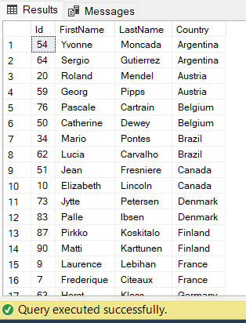

💡 **Insight:**  
Identifies power users — useful for loyalty rewards or targeted upselling.

---

### 🏆 Q36 – View: Products Above Average Price
💻 **Method:** `VIEW`  
```sql
CREATE VIEW Products_View
AS
       SELECT ProductName, UnitPrice
       FROM Product
       WHERE UnitPrice > (SELECT AVG(UnitPrice) FROM Product)

SELECT* FROM Products_View;
```
📸 **Screenshot:**  
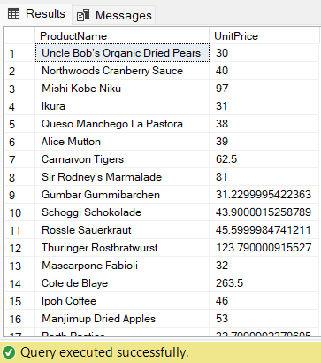

💡 **Insight:**  
This view provides a dynamic list of higher-priced products — useful for premium segmentation, marketing, and pricing strategy comparisons.
---

### 🏆 🛠️ Q37 – Stored Procedure to Recreate Product Copy with Supplier Name
💻 **Method:** Wrote a STORED PROCEDURE that:

Checks if Product_Copy table exists

Drops it if it exists

Recreates it by joining with Supplier to include CompanyName as Supplier_Name
```sql
CREATE PROCEDURE Prod_Supp
AS 
  IF 'Product_Copy' in (SELECT table_name FROM  INFORMATION_SCHEMA.TABLES)
  BEGIN
      DROP TABLE Product_Copy
      SELECT P.*, S.CompanyName AS Supplier_Name INTO Product_Copy2
	  FROM Product AS P
	  LEFT JOIN Supplier AS S
	  ON P.SupplierId = S.Id
  END

EXEC Prod_Supp

SELECT* FROM Product_Copy2;
```
📸 **Screenshot:**  
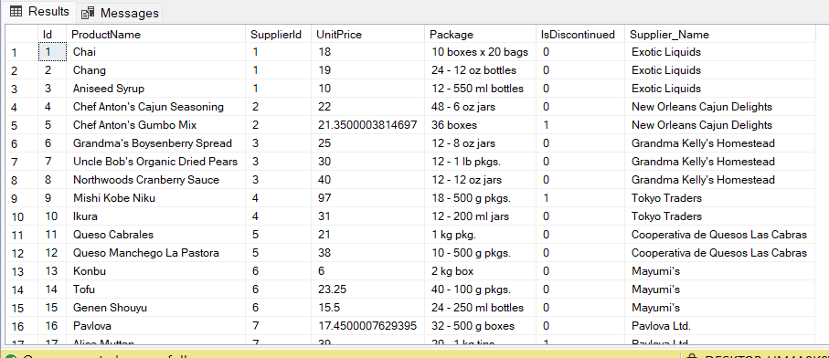

💡 **Insight:**  
Automates creation of an enriched product dataset for downstream analysis or backup. 

---

## 🗃️ Project Files

- `ADVANCE_SQL_CASE_STUDY.sql` — Full SQL code (Q1–Q37)  
- `README.md` — Markdown documentation  
- `/images/` — Placeholder for query screenshots  

---

## 🙋‍♀️ About Me

I'm Kashish, a budding data analyst with a passion for solving complex business questions using SQL and data tools. This project helped me deepen my understanding of relational databases and SQL optimizations.

📫 [LinkedIn](https://www.linkedin.com/in/kashish-kwatra)  
📁 [GitHub](https://github.com/KashishKwatra)
